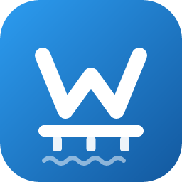

<div align="center">



# WPDock

**Локальная разработка WordPress прямо внутри VS Code. Без Docker.**

Создавайте локальные сайты в один клик, синхронизируйте файлы и базу с боевым сервером без FTP, работайте с Git и живым предпросмотром — не выходя из редактора.


</div>

---

## Что это

WPDock — встроенный в VS Code аналог LocalWP. Каждый сайт поднимается на **портативном рантайме** (PHP + MariaDB + nginx/Apache + WP-CLI) — Docker не нужен. На Windows бинарники скачиваются автоматически при первом запуске; на macOS/Linux используется системный PHP. Управление полностью живёт в боковой панели редактора, а отдельная панель «Текущий сайт» показывает настройки того проекта, который открыт в рабочей области.

## Установка одной командой

Откройте терминал в VS Code (**Ctrl+`**) и вставьте:

```powershell
git clone https://github.com/C0dece/wpdock.git; cd wpdock; npm install; npm run deploy:local
```

Команда склонирует репозиторий, поставит все зависимости, соберёт расширение, упакует VSIX и установит его в VS Code. После завершения перезагрузите окно (**Ctrl+Shift+P → Developer: Reload Window**) — в боковой панели появится иконка WPDock.

> Терминал VS Code на Windows по умолчанию — PowerShell, команда рассчитана на него. На macOS/Linux замените `;` на `&&`.

### Требования

- **Node.js 18+** и **Git** в `PATH`
- **VS Code 1.106+**
- ОС: Windows 10/11 (рантайм качается автоматически) либо macOS/Linux с системным PHP
- **Docker не требуется**

## Возможности

### 🚀 Локальная среда (без Docker)

- Создание сайта WordPress в один клик на портативном рантайме (PHP + MariaDB)
- Выбор версии PHP, веб-сервера (PHP / nginx / Apache), локали и HTTPS при создании
- Красивые локальные адреса вида `site.local` без указания порта
- HTTPS с локальным CA (доверенные сертификаты на домен)
- Старт/стоп/перезапуск, авто-восстановление зависших процессов
- Точный статус сайтов между несколькими окнами VS Code

### 🔄 Синхронизация с удалёнными сайтами (без FTP)

- Подключение боевого WordPress по Application Passwords
- Pull/Push файлов `wp-content` и базы данных через HTTP-агент
- Возобновляемый (resumable) Pull и chunked Push для больших сайтов
- Привязка нескольких удалённых сайтов к одному локальному проекту
- История синхронизаций и сброс удалённого WP до заводских настроек
- **Отмена любой длительной операции** (Pull/Push/создание сайта) на лету

### ⚡ Live Preview

- Горячая перезагрузка через same-origin SSE + chokidar (без отдельного порта)
- `.css` — горячая подмена стиля без перезагрузки; `.php`/шаблоны — полный reload

### 🔧 Git и деплой

- Инициализация репозитория и привязка GitHub из панели
- Генератор GitHub Actions для деплоя

### 💾 Бэкапы

- Локальные ZIP-бэкапы и выгрузка в облако (Yandex Disk / Google Drive)
- Экспорт и импорт сайта одним архивом

## Команды npm

| Команда | Назначение |
| --- | --- |
| `npm run deploy:local` | Полный build → VSIX → установка в VS Code (Windows/PowerShell) |
| `npm run compile` | Сборка расширения и webview |
| `npm run pack-agent` | Упаковка PHP-агента в ZIP |
| `npm run watch` | Watch-режим сборки расширения |
| `npm run watch:webview` | Dev-сервер Vite для webview |

### Запуск для разработки

```bash
npm install   # ставит зависимости расширения и webview-ui (postinstall)
```

Затем `F5` в VS Code — откроется Extension Development Host.

## Как работает удалённая синхронизация

1. Подключение проверяет WP REST API с Application Password.
2. На сервер ставится лёгкий плагин-агент (`wpdock-agent`) — без FTP и SSH.
3. Агент регистрирует токен и упаковывает `wp-content` + дамп БД в ZIP.
4. **Pull** — архив скачивается (порциями, с докачкой) и распаковывается в локальный сайт.
5. **Push** — локальный `wp-content` загружается chunked-передачей, агент распаковывает его на сервере.

### Безопасность агента

- Токен = `SHA256(Application Password)`, хранится в transient WordPress (1 час).
- Временные файлы лежат в `wp-content/wpdock-temp/` под защитой `.htaccess`.
- Cron очищает временные файлы каждый час.

## Технологии

- **Расширение**: TypeScript + VS Code API (бандл esbuild)
- **UI**: React 18 + Vite (WebView-панель)
- **Рантайм**: портативные PHP (NTS) + MariaDB 10.11 + nginx/Apache + WP-CLI — без Docker
- **Portless URLs**: hosts + Windows `netsh portproxy`, маршрутизация по `Host`
- **Удалённая синхронизация**: PHP-агент по HTTP (ZIP + дамп БД)
- **Live Preview**: same-origin SSE + chokidar
- **Git**: simple-git + генератор GitHub Actions

## Лицензия

[MIT](LICENSE) © C0dece
